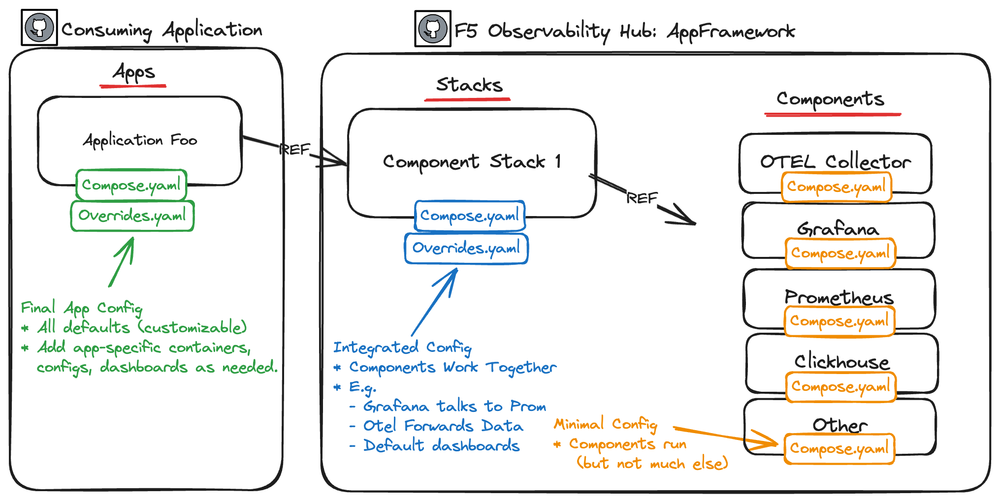
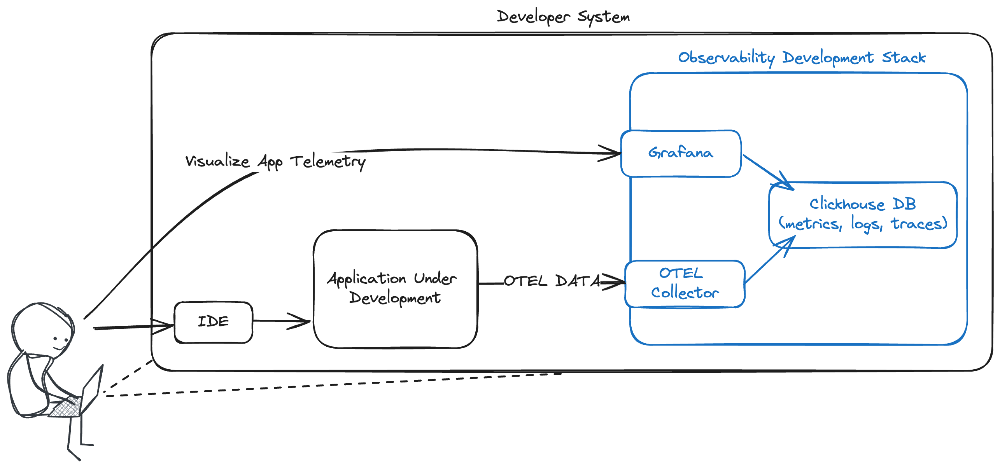
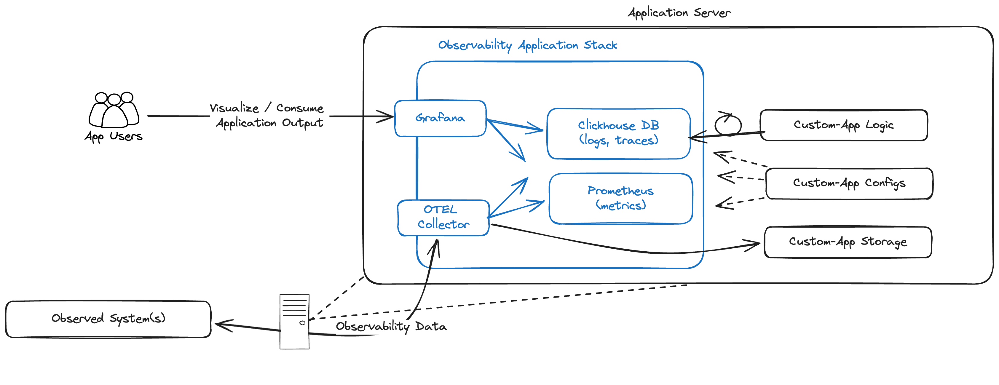

# Observability Hub - AppFramework

## Overview
This project provides a flexible framework for quickly building and experimenting with observability apps.
It offers a collection of tools and components designed to streamline the creation of data pipelines,
visualization dashboards, and monitoring systems, ideal for proof-of-concept development, rapid iteration, and exploration of observability use-cases.
While not intended for production environments, this setup serves as an adaptable starting point for building custom solutions that help gather,
process, and visualize application and infrastructure observability data.

To facilitate rapid development and experimentation, this repository leverages Docker Compose and its built-in import and override functionality.
Presently, we maintain two base "solution stacks" composed of observability components, each tailored to a distinct use case. Both should be considered
a starting point, and projects which are developed against these are expected to add / extend functionality through additional logic, compontents,
and other customizations.

### Why Should You Use This?
Building on top of this repository as the core allows you to focus on the higher-level aspects of your solution without getting bogged down 
in the complexities of underlying infrastructure and configuration. By leveraging this framework, many of the lower level configuration and setup steps can be skipped,
as it provides well-considered defaults, follows best practices, self-monitors out of the box, and ensures a solid foundation for collecting and visualizing data.
This allows you to allocate your time and effort toward solving the unique challenges of your application, rather than reinventing the "data plumbing" aspects
with every new use-case.

### Observability Developer Stack
The first stack is designed for local development environments, providing a straightforward setup for developers building systems which emit
observability data in Opentelemetry (or other) format. The stack contains everything necessary to fetch / receive data, store it, and
build visualizations around that data. In the future, additional capabilities for validating the emmited data and similar functionality
may be added.

An example use case for this stack might be a developer working to instrument an application with an OTEL SDK.
They would run the solution stack on their laptop, and configure their develpment instance / SDK to forward OTEL metrics/logs/traces to
the stack OTEL collector endpoint (e.g. localhost:4317). As they develop, they can use the stack to validate the output formats and behavior
against expectations.

### Observability Application Stack
The second stack is geared toward those looking to build applications that consume, process, and visualize telemetry data, offering a foundation
for creating powerful prototype monitoring and analytics solutions. By utilizing Docker Compose's flexibility, the stack can be easily customized and extended
to meet specific needs, making it simple to switch between different configurations or adapt the environment as requirements evolve.

An example use case would be the Application Study Tool, a BigIP Telemetry visualization tool. It leverages the Observability Hub
Application Components as the core of the tool, providing a mechanism for fetching, storing, and visualizing data. It cusomizes this
basic functionality through the addition of custom OTEL Collector Configurations to gather data from BigIPs, and custom Grafana dashboards
for visualizing this data. By leveraging the Application Components, they can spend more time focusing on the specific use case,
and less time on composing the lower level components.

